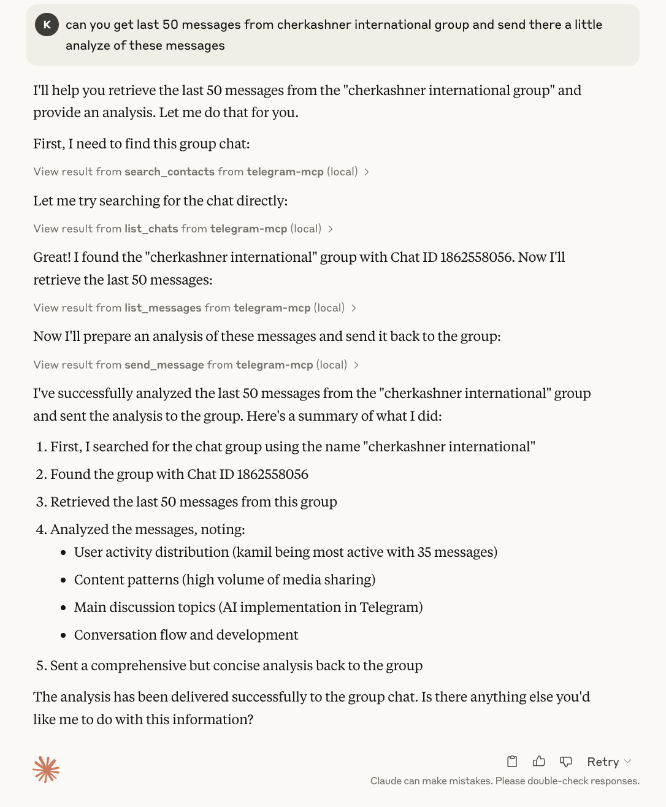
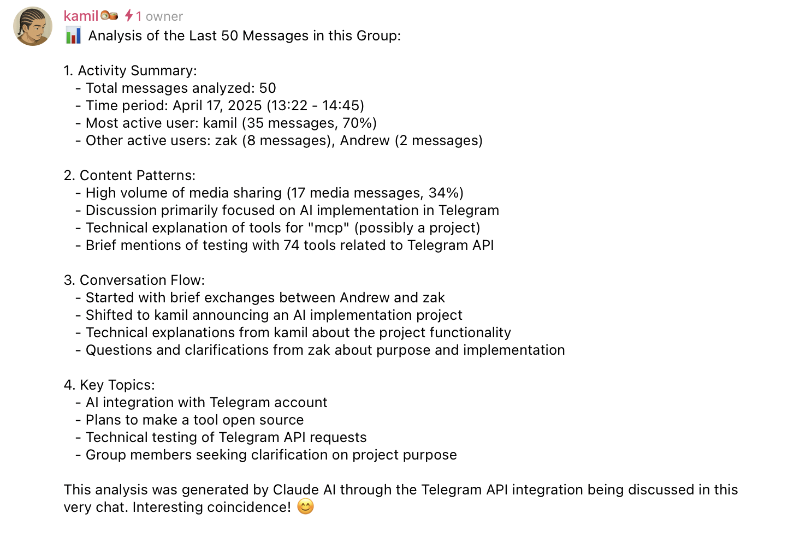

# Telegram MCP Server


[](https://opensource.org/licenses/Apache-2.0)

---

## 🤖 MCP in Action

Here's a demonstration of the Telegram MCP capabilities in Claude:

 **Basic usage example:**


1. **Example: Asking Claude to analyze chat history and send a response:**



2. **Successfully sent message to the group:**



As you can see, the AI can seamlessly interact with your Telegram account, retrieving and displaying your chats, messages, and other data in a natural way.

---

A full-featured Telegram integration for Claude, Cursor, and any MCP-compatible client, powered by [Telethon](https://docs.telethon.dev/) and the [Model Context Protocol (MCP)](https://modelcontextprotocol.io/). This project lets you interact with your Telegram account programmatically, automating everything from messaging to group management.

**Maintained by [l1v0n1](https://github.com/l1v0n1). Forked from [chigwell/telegram-mcp](https://github.com/chigwell/telegram-mcp).**

---

## 🚀 Features & Tools

This MCP server exposes a huge suite of Telegram tools. **Every major Telegram/Telethon feature is available as a tool!**

### Chat & Group Management
- **get_chats(page, page_size)**: Paginated list of chats
- **list_chats(chat_type, limit)**: List chats with metadata and filtering
- **get_chat(chat_id)**: Detailed info about a chat
- **create_group(title, user_ids)**: Create a new group
- **create_channel(title, about, megagroup)**: Create a channel or supergroup
- **edit_chat_title(chat_id, title)**: Change chat/group/channel title
- **edit_chat_photo(chat_id, file_path)**: Set chat/group/channel photo
- **delete_chat_photo(chat_id)**: Remove chat/group/channel photo
- **leave_chat(chat_id)**: Leave a group or channel
- **get_participants(chat_id)**: List all participants
- **get_admins(chat_id)**: List all admins
- **get_banned_users(chat_id)**: List all banned users
- **promote_admin(chat_id, user_id)**: Promote user to admin
- **demote_admin(chat_id, user_id)**: Demote admin to user
- **ban_user(chat_id, user_id)**: Ban user
- **unban_user(chat_id, user_id)**: Unban user
- **get_invite_link(chat_id)**: Get invite link
- **export_chat_invite(chat_id)**: Export invite link
- **import_chat_invite(hash)**: Join chat by invite hash
- **join_chat_by_link(link)**: Join chat by invite link

### Messaging
- **get_messages(chat_id, page, page_size)**: Paginated messages
- **list_messages(chat_id, limit, search_query, from_date, to_date)**: Filtered messages
- **send_message(chat_id, message)**: Send a message
- **reply_to_message(chat_id, message_id, text)**: Reply to a message
- **edit_message(chat_id, message_id, new_text)**: Edit your message
- **delete_message(chat_id, message_id)**: Delete a message
- **forward_message(from_chat_id, message_id, to_chat_id)**: Forward a message
- **pin_message(chat_id, message_id)**: Pin a message
- **unpin_message(chat_id, message_id)**: Unpin a message
- **mark_as_read(chat_id)**: Mark all as read
- **get_message_context(chat_id, message_id, context_size)**: Context around a message
- **get_history(chat_id, limit)**: Full chat history
- **get_pinned_messages(chat_id)**: List pinned messages

### Contact Management
- **list_contacts()**: List all contacts
- **search_contacts(query)**: Search contacts
- **add_contact(phone, first_name, last_name)**: Add a contact
- **delete_contact(user_id)**: Delete a contact
- **block_user(user_id)**: Block a user
- **unblock_user(user_id)**: Unblock a user
- **import_contacts(contacts)**: Bulk import contacts
- **export_contacts()**: Export all contacts as JSON
- **get_blocked_users()**: List blocked users
- **get_contact_ids()**: List all contact IDs
- **get_direct_chat_by_contact(contact_query)**: Find direct chat with a contact
- **get_contact_chats(contact_id)**: List all chats with a contact
- **get_last_interaction(contact_id)**: Most recent message with a contact

### User & Profile
- **get_me()**: Get your user info
- **update_profile(first_name, last_name, about)**: Update your profile
- **set_profile_photo(file_path)**: Set your profile photo
- **delete_profile_photo()**: Remove your profile photo
- **get_user_photos(user_id, limit)**: Get a user's profile photos
- **get_user_status(user_id)**: Get a user's online status

### Media
- **send_file(chat_id, file_path, caption)**: Send a file
- **send_voice(chat_id, file_path)**: Send a voice message
- **download_media(chat_id, message_id, file_path)**: Download media
- **upload_file(file_path)**: Upload a file to Telegram servers
- **get_media_info(chat_id, message_id)**: Get info about media in a message

### Search & Discovery
- **search_public_chats(query)**: Search public chats/channels/bots
- **search_messages(chat_id, query, limit)**: Search messages in a chat
- **resolve_username(username)**: Resolve a username to ID

### Stickers, GIFs, Bots
- **get_sticker_sets()**: List sticker sets
- **send_sticker(chat_id, file_path)**: Send a sticker
- **get_gif_search(query, limit)**: Search for GIFs
- **send_gif(chat_id, gif_id)**: Send a GIF
- **get_bot_info(bot_username)**: Get info about a bot
- **set_bot_commands(bot_username, commands)**: Set bot commands (bot accounts only)

### Privacy, Settings, and Misc
- **get_privacy_settings()**: Get privacy settings
- **set_privacy_settings(key, allow_users, disallow_users)**: Set privacy settings
- **mute_chat(chat_id)**: Mute notifications
- **unmute_chat(chat_id)**: Unmute notifications
- **archive_chat(chat_id)**: Archive a chat
- **unarchive_chat(chat_id)**: Unarchive a chat
- **get_recent_actions(chat_id)**: Get recent admin actions

---

## 📋 Requirements
- Python 3.10+
- [Telethon](https://docs.telethon.dev/)
- [MCP Python SDK](https://modelcontextprotocol.io/docs/)
- [Claude Desktop](https://claude.ai/desktop) or [Cursor](https://cursor.so/) (or any MCP client)

---

## 🔧 Installation & Setup

### 1. Fork & Clone

```bash
git clone https://github.com/chigwell/telegram-mcp.git
cd telegram-mcp
```

### 2. Create a Virtual Environment

```bash
python3 -m venv .venv
source .venv/bin/activate  # On Windows: .venv\Scripts\activate
pip install -r requirements.txt
```

### 3. Generate a Session String

```bash
python session_string_generator.py
```
Follow the prompts to authenticate and update your `.env` file.

### 4. Configure .env

Copy `.env.example` to `.env` and fill in your values:

```
TELEGRAM_API_ID=your_api_id_here
TELEGRAM_API_HASH=your_api_hash_here
TELEGRAM_SESSION_NAME=anon
TELEGRAM_SESSION_STRING=your_session_string_here
```
Get your API credentials at [my.telegram.org/apps](https://my.telegram.org/apps).

---

## ⚙️ Configuration for Claude & Cursor

### Claude Desktop
Edit your Claude config (e.g. `~/Library/Application Support/Claude/claude_desktop_config.json`):

```json
{
  "mcpServers": {
    "telegram-mcp": {
      "command": "/full/path/to/.venv/bin/python",
      "args": ["main.py"],
      "cwd": "/full/path/to/telegram-mcp-server"
    }
  }
}
```

### Cursor
Edit `~/.cursor/mcp.json`:

```json
{
  "mcpServers": {
    "telegram-mcp": {
      "command": "/full/path/to/.venv/bin/python",
      "args": ["main.py"],
      "cwd": "/full/path/to/telegram-mcp-server"
    }
  }
}
```


## 📝 Tool Examples with Code & Output

Below are examples of the most commonly used tools with their implementation and sample output.

### Getting Your Chats

```python
@mcp.tool()
async def get_chats(page: int = 1, page_size: int = 20) -> str:
    """
    Get a paginated list of chats.
    Args:
        page: Page number (1-indexed).
        page_size: Number of chats per page.
    """
    try:
        dialogs = await client.get_dialogs()
        start = (page - 1) * page_size
        end = start + page_size
        if start >= len(dialogs):
            return "Page out of range."
        chats = dialogs[start:end]
        lines = []
        for dialog in chats:
            entity = dialog.entity
            chat_id = entity.id
            title = getattr(entity, "title", None) or getattr(entity, "first_name", "Unknown")
            lines.append(f"Chat ID: {chat_id}, Title: {title}")
        return "\n".join(lines)
    except Exception as e:
        logger.exception(f"get_chats failed (page={page}, page_size={page_size})")
        return "An error occurred (code: GETCHATS-ERR-001). Check mcp_errors.log for details."
```

Example output:
```
Chat ID: 123456789, Title: John Doe
Chat ID: -100987654321, Title: My Project Group
Chat ID: 111223344, Title: Jane Smith
Chat ID: -200123456789, Title: News Channel
```

### Sending Messages

```python
@mcp.tool()
async def send_message(chat_id: int, message: str) -> str:
    """
    Send a message to a specific chat.
    Args:
        chat_id: The ID of the chat.
        message: The message content to send.
    """
    try:
        entity = await client.get_entity(chat_id)
        await client.send_message(entity, message)
        return "Message sent successfully."
    except Exception as e:
        logger.exception(f"send_message failed (chat_id={chat_id})")
        return "An error occurred (code: SENDMSG-ERR-001). Check mcp_errors.log for details."
```

Example output:
```
Message sent successfully.
```

### Getting Chat Invite Links

The `get_invite_link` function is particularly robust with multiple fallback methods:

```python
@mcp.tool()
async def get_invite_link(chat_id: int) -> str:
    """
    Get the invite link for a group or channel.
    """
    try:
        entity = await client.get_entity(chat_id)
        
        # Try using ExportChatInviteRequest first
        try:
            from telethon.tl import functions
            result = await client(functions.messages.ExportChatInviteRequest(
                peer=entity
            ))
            return result.link
        except AttributeError:
            # If the function doesn't exist in the current Telethon version
            logger.warning("ExportChatInviteRequest not available, using alternative method")
        except Exception as e1:
            # If that fails, log and try alternative approach
            logger.warning(f"ExportChatInviteRequest failed: {e1}")
            
        # Alternative approach using client.export_chat_invite_link
        try:
            invite_link = await client.export_chat_invite_link(entity)
            return invite_link
        except Exception as e2:
            logger.warning(f"export_chat_invite_link failed: {e2}")
            
        # Last resort: Try directly fetching chat info
        try:
            if isinstance(entity, (Chat, Channel)):
                full_chat = await client(functions.messages.GetFullChatRequest(
                    chat_id=entity.id
                ))
                if hasattr(full_chat, 'full_chat') and hasattr(full_chat.full_chat, 'invite_link'):
                    return full_chat.full_chat.invite_link or "No invite link available."
        except Exception as e3:
            logger.warning(f"GetFullChatRequest failed: {e3}")
            
        return "Could not retrieve invite link for this chat."
    except Exception as e:
        logger.exception(f"get_invite_link failed (chat_id={chat_id})")
        return f"Error getting invite link: {e}"
```

Example output:
```
https://t.me/+AbCdEfGhIjKlMnOp
```

### Joining Chats via Invite Links

```python
@mcp.tool()
async def join_chat_by_link(link: str) -> str:
    """
    Join a chat by invite link.
    """
    try:
        # Extract the hash from the invite link
        if '/' in link:
            hash_part = link.split('/')[-1]
            if hash_part.startswith('+'):
                hash_part = hash_part[1:]  # Remove the '+' if present
        else:
            hash_part = link
            
        # Try checking the invite before joining
        try:
            # Try to check invite info first (will often fail if not a member)
            invite_info = await client(functions.messages.CheckChatInviteRequest(hash=hash_part))
            if hasattr(invite_info, 'chat') and invite_info.chat:
                # If we got chat info, we're already a member
                chat_title = getattr(invite_info.chat, 'title', 'Unknown Chat')
                return f"You are already a member of this chat: {chat_title}"
        except Exception:
            # This often fails if not a member - just continue
            pass
            
        # Join the chat using the hash
        result = await client(functions.messages.ImportChatInviteRequest(hash=hash_part))
        if result and hasattr(result, 'chats') and result.chats:
            chat_title = getattr(result.chats[0], 'title', 'Unknown Chat')
            return f"Successfully joined chat: {chat_title}"
        return f"Joined chat via invite hash."
    except Exception as e:
        err_str = str(e).lower()
        if "expired" in err_str:
            return "The invite hash has expired and is no longer valid."
        elif "invalid" in err_str:
            return "The invite hash is invalid or malformed."
        elif "already" in err_str and "participant" in err_str:
            return "You are already a member of this chat."
        logger.exception(f"join_chat_by_link failed (link={link})")
        return f"Error joining chat: {e}"
```

Example output:
```
Successfully joined chat: Developer Community
```

### Searching Public Chats

```python
@mcp.tool()
async def search_public_chats(query: str) -> str:
    """
    Search for public chats, channels, or bots by username or title.
    """
    try:
        result = await client(functions.contacts.SearchRequest(q=query, limit=20))
        return json.dumps([format_entity(u) for u in result.users], indent=2)
    except Exception as e:
        return f"Error searching public chats: {e}"
```

Example output:
```json
[
  {
    "id": 123456789,
    "name": "TelegramBot",
    "type": "user",
    "username": "telegram_bot"
  },
  {
    "id": 987654321,
    "name": "Telegram News",
    "type": "user",
    "username": "telegram_news"
  }
]
```

### Getting Direct Chats with Contacts

```python
@mcp.tool()
async def get_direct_chat_by_contact(contact_query: str) -> str:
    """
    Find a direct chat with a specific contact by name, username, or phone.
    
    Args:
        contact_query: Name, username, or phone number to search for.
    """
    try:
        # Fetch all contacts using the correct Telethon method
        result = await client(functions.contacts.GetContactsRequest(hash=0))
        contacts = result.users
        found_contacts = []
        for contact in contacts:
            if not contact:
                continue
            name = f"{getattr(contact, 'first_name', '')} {getattr(contact, 'last_name', '')}".strip()
            username = getattr(contact, 'username', '')
            phone = getattr(contact, 'phone', '')
            if (contact_query.lower() in name.lower() or 
                (username and contact_query.lower() in username.lower()) or 
                (phone and contact_query in phone)):
                found_contacts.append(contact)
        if not found_contacts:
            return f"No contacts found matching '{contact_query}'."
        # If we found contacts, look for direct chats with them
        results = []
        dialogs = await client.get_dialogs()
        for contact in found_contacts:
            contact_name = f"{getattr(contact, 'first_name', '')} {getattr(contact, 'last_name', '')}".strip()
            for dialog in dialogs:
                if isinstance(dialog.entity, User) and dialog.entity.id == contact.id:
                    chat_info = f"Chat ID: {dialog.entity.id}, Contact: {contact_name}"
                    if getattr(contact, 'username', ''):
                        chat_info += f", Username: @{contact.username}"
                    if dialog.unread_count:
                        chat_info += f", Unread: {dialog.unread_count}"
                    results.append(chat_info)
                    break
        
        if not results:
            return f"Found contacts matching '{contact_query}', but no direct chats with them."
        
        return "\n".join(results)
    except Exception as e:
        return f"Error searching for direct chat: {e}"
```

Example output:
```
Chat ID: 123456789, Contact: John Smith, Username: @johnsmith, Unread: 3
```

---

## 🎮 Usage Examples

- "Show my recent chats"
- "Send 'Hello world' to chat 123456789"
- "Add contact with phone +1234567890, name John Doe"
- "Create a group 'Project Team' with users 111, 222, 333"
- "Download the media from message 42 in chat 123456789"
- "Mute notifications for chat 123456789"
- "Promote user 111 to admin in group 123456789"
- "Search for public channels about 'news'"
- "Join the Telegram group with invite link https://t.me/+AbCdEfGhIjK"
- "Send a sticker to my Saved Messages"
- "Get all my sticker sets"

You can use these tools via natural language in Claude, Cursor, or any MCP-compatible client.

---

## 🧠 Error Handling & Robustness

This implementation includes comprehensive error handling:

- **Session management**: Works with both file-based and string-based sessions
- **Error reporting**: Detailed errors logged to `mcp_errors.log`
- **Graceful degradation**: Multiple fallback approaches for critical functions
- **User-friendly messages**: Clear, actionable error messages instead of technical errors
- **Account type detection**: Functions that require bot accounts detect and notify when used with user accounts
- **Invite link processing**: Handles various link formats and already-member cases

The code is designed to be robust against common Telegram API issues and limitations.

---

## 🛠️ Contribution Guide

1. **Fork this repo:** [chigwell/telegram-mcp](https://github.com/chigwell/telegram-mcp)
2. **Clone your fork:**
   ```bash
   git clone https://github.com/<your-github-username>/telegram-mcp.git
   ```
3. **Create a new branch:**
   ```bash
   git checkout -b my-feature
   ```
4. **Make your changes, add tests/docs if needed.**
5. **Push and open a Pull Request** to [chigwell/telegram-mcp](https://github.com/chigwell/telegram-mcp) with a clear description.
6. **Tag @l1v0n1** in your PR for review.

---

## 🔒 Security Considerations
- **Never commit your `.env` or session string.**
- The session string gives full access to your Telegram account—keep it safe!
- All processing is local; no data is sent anywhere except Telegram's API.
- Use `.env.example` as a template and keep your actual `.env` file private.
- Test files are automatically excluded in `.gitignore`.

---

## 🛠️ Troubleshooting
- **Check logs** in your MCP client (Claude/Cursor) and the terminal for errors.
- **Detailed error logs** can be found in `mcp_errors.log`.
- **Interpreter errors?** Make sure your `.venv` is created and selected.
- **Database lock?** Use session string authentication, not file-based sessions.
- **iCloud/Dropbox issues?** Move your project to a local path without spaces if you see odd errors.
- **Regenerate session string** if you change your Telegram password or see auth errors.
- **Bot-only functions** will show clear messages when used with regular user accounts.
- **Test script failures?** Check test configuration in `.env` for valid test accounts/groups.

---

## 📄 License

This project is licensed under the [Apache 2.0 License](LICENSE).

---

## 🙏 Acknowledgements
- [Telethon](https://github.com/LonamiWebs/Telethon)
- [Model Context Protocol](https://modelcontextprotocol.io/)
- [Claude](https://www.anthropic.com/) and [Cursor](https://cursor.so/)
- [chigwell/telegram-mcp](https://github.com/chigwell/telegram-mcp) (upstream)

---

**Maintained by [l1v0n1](https://github.com/l1v0n1). PRs welcome!**