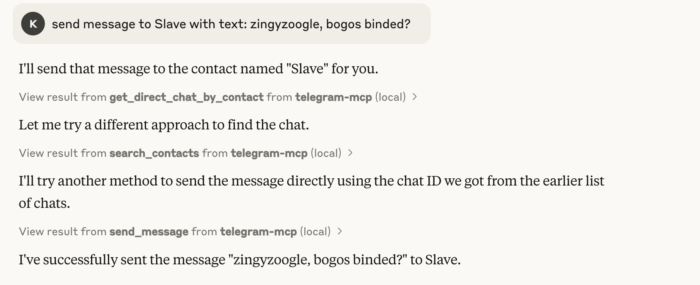

# Telegram MCP for Claude


[](https://opensource.org/licenses/Apache-2.0)

A powerful Telegram integration for Claude via the Model Context Protocol (MCP), allowing you to interact with your Telegram account directly from Claude Desktop.



## 🚀 Features

This MCP server provides a comprehensive suite of tools for seamless Telegram interaction:

### Chat Management
- **get_chats** - Get a paginated list of your chats
- **list_chats** - List all chats with detailed metadata and filtering options
- **get_chat** - Get detailed information about a specific chat

### Messaging
- **get_messages** - Get messages from a specific chat with pagination
- **list_messages** - Retrieve messages with powerful filtering (text search, date ranges)
- **send_message** - Send messages to any chat
- **get_message_context** - View the context around a specific message

### Contact Management
- **search_contacts** - Find contacts by name, username or phone number
- **get_direct_chat_by_contact** - Find personal chats with specific contacts
- **get_contact_chats** - List all chats (including groups) involving a contact
- **get_last_interaction** - View your most recent exchanges with a contact

## 📋 Requirements

- Python 3.10+
- [Telethon](https://docs.telethon.dev/) for Telegram API access
- [MCP Python SDK](https://modelcontextprotocol.io/docs/)
- [UV](https://astral.sh/uv/) package manager
- [Claude Desktop](https://claude.ai/desktop) app

## 🔧 Installation

### 1. Clone the Repository

```bash
git clone https://github.com/l1v0n1/telegram-mcp-server
cd telegram-mcp-server
```

### 2. Generate Session String

For better security and portability, this project uses Telethon's StringSession. Generate your session string:

```bash
python session_string_generator.py
```

This will:
1. Ask for your phone number
2. Send a verification code to your Telegram app
3. Generate a session string and add it to your `.env` file

The session string allows authentication without storing SQLite session files, which helps avoid database lock issues and improves portability.

### 3. Set Up Your Environment

Create a `.env` file with your Telegram credentials:

```
TELEGRAM_API_ID=your_api_id_here
TELEGRAM_API_HASH=your_api_hash_here
TELEGRAM_SESSION_NAME=anon
TELEGRAM_SESSION_STRING=your_session_string_here
```

You can obtain API credentials at [my.telegram.org/apps](https://my.telegram.org/apps).

### 4. Install Dependencies

```bash
uv venv
source .venv/bin/activate  # On Windows: .venv\Scripts\activate
uv add "mcp[cli]" telethon python-dotenv nest_asyncio
```

### 5. Configure Claude Desktop

#### On macOS/Linux:
Edit `~/Library/Application Support/Claude/claude_desktop_config.json`:

```json
{
    "mcpServers": {
        "telegram-mcp": {
            "command": "/full/path/to/uv",
            "args": [
                "--directory",
                "/full/path/to/telegram-mcp-server",
                "run",
                "main.py"
            ]
        }
    }
}
```

#### On Windows:
Edit `%APPDATA%\Claude\claude_desktop_config.json` with similar configuration.

## 🎮 Usage Examples

Here are some ways to interact with Telegram through Claude:

### Basic Chat Navigation
- "Show me my most recent chats"
- "List my group chats with unread messages"
- "Show detailed information about chat 123456789"

### Messaging
- "Show me the last 10 messages from chat 123456789"
- "Send 'I'll be there in 10 minutes' to chat 123456789"
- "Find messages containing 'meeting' in chat 123456789"
- "Show messages from March 1-15, 2023 in chat 123456789"

### Contact Interactions
- "Search for contacts named 'Alex'"
- "Find my direct chat with John"
- "Show all chats where I interact with contact 987654321"
- "Show my last conversation with Lisa"

### Advanced Features
- "Show the context around message 42 in chat 123456789"
- "List all channels I'm subscribed to"

## 🔒 Security Considerations

- **Private API Keys**: Never commit your `.env` file or session files to Git repositories
- **Session String**: The session string in your `.env` file provides full access to your Telegram account. Keep it secure.
- **Local Processing**: All Telegram data is processed locally on your machine - no data is sent to external servers beyond Telegram's own API.
- **Permissions**: The MCP server has the same access to Telegram as you would have with the official app, including reading and sending messages.

## 🛠️ Troubleshooting

If you encounter issues:

1. Check Claude Desktop logs for error messages
2. Ensure your Telegram API credentials are correct
3. Verify that the paths in your Claude Desktop config are absolute and correct
4. If you see database lock errors, use the session string authentication method
5. If you need to regenerate your session string, run `python session_string_generator.py` again

## 📄 License

This project is licensed under the [Apache 2.0 License](LICENSE).

## 🙏 Acknowledgements

- [Telethon](https://github.com/LonamiWebs/Telethon) for the Telegram client library
- [Model Context Protocol](https://modelcontextprotocol.io/) for the integration framework
- [Anthropic](https://www.anthropic.com/) for Claude and the Claude Desktop app